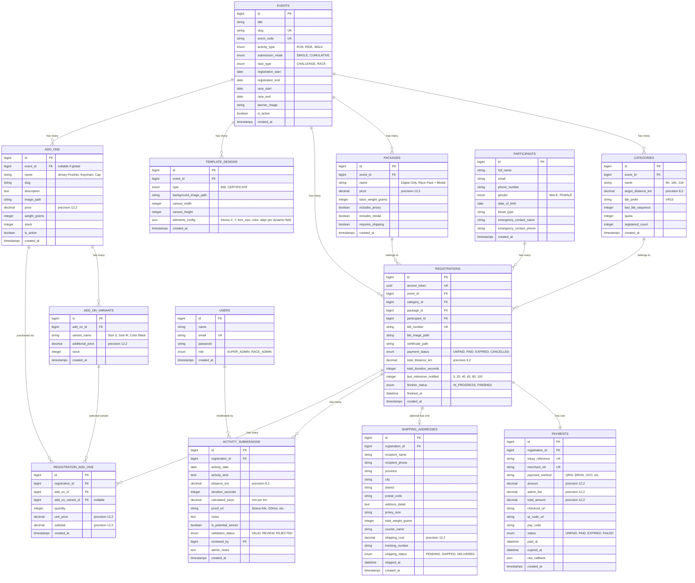

# Skema Database — VIRA (Virtual Run, Ride, & Walk)

---

## 1. Entity Relationship Diagram (ERD)



---

## 2. Struktur Tabel & Spesifikasi Migration Laravel

### 2.1 Tabel `events`
```php
Schema::create('events', function (Blueprint $table) {
    $table->id();
    $table->string('title');
    $table->string('slug')->unique();
    $table->string('event_code', 10)->unique(); // Kode Unik Event (contoh: MVR26, JVR26, VIRA01) untuk prefix e-BIB global
    $table->enum('activity_type', ['RUN', 'RIDE', 'WALK'])->default('RUN');
    $table->enum('submission_mode', ['SINGLE', 'CUMULATIVE'])->default('CUMULATIVE');
    $table->enum('race_type', ['CHALLENGE', 'RACE'])->default('CHALLENGE');
    $table->text('description')->nullable();
    $table->text('rules_and_terms')->nullable();
    $table->dateTime('registration_start');
    $table->dateTime('registration_end');
    $table->dateTime('race_start');
    $table->dateTime('race_end');
    $table->string('banner_image')->nullable();
    $table->boolean('is_active')->default(true);
    $table->timestamps();

    $table->index(['activity_type', 'is_active']);
    $table->index(['registration_start', 'registration_end']);
});
```

---

### 2.2 Tabel `template_designs` (E-BIB & E-Certificate Designer)
Menyimpan gambar background dan konfigurasi koordinat X, Y, ukuran font, jenis huruf, warna, dan perataan teks untuk render e-BIB dan E-Sertifikat secara visual.
```php
Schema::create('template_designs', function (Blueprint $table) {
    $table->id();
    $table->foreignId('event_id')->constrained('events')->cascadeOnDelete();
    $table->enum('type', ['BIB', 'CERTIFICATE']);
    $table->string('background_image_path');
    $table->unsignedInteger('canvas_width')->default(1200); // Lebar canvas pixel
    $table->unsignedInteger('canvas_height')->default(800); // Tinggi canvas pixel
    
    // JSON konfigurasi per elemen:
    // Contoh elemen:
    // [
    //   { "key": "bib_number", "x": 600, "y": 420, "font_size": 72, "font_family": "BebasNeue", "color": "#FF5500", "align": "center", "visible": true },
    //   { "key": "participant_name", "x": 600, "y": 540, "font_size": 36, "font_family": "Inter-Bold", "color": "#FFFFFF", "align": "center", "visible": true },
    //   { "key": "category_name", "x": 600, "y": 600, "font_size": 24, "font_family": "Inter-Regular", "color": "#CCCCCC", "align": "center", "visible": true },
    //   { "key": "total_distance", "x": 400, "y": 680, "font_size": 28, "font_family": "Inter-Bold", "color": "#00E5FF", "align": "center", "visible": true },
    //   { "key": "total_duration", "x": 800, "y": 680, "font_size": 28, "font_family": "Inter-Bold", "color": "#00E5FF", "align": "center", "visible": true },
    //   { "key": "average_pace", "x": 600, "y": 740, "font_size": 22, "font_family": "Inter-Medium", "color": "#E2E8F0", "align": "center", "visible": true },
    //   { "key": "finish_date", "x": 600, "y": 800, "font_size": 20, "font_family": "Inter-Regular", "color": "#94A3B8", "align": "center", "visible": true },
    //   { "key": "qr_code", "x": 1050, "y": 680, "size": 110, "visible": true }
    // ]
    $table->json('elements_config'); 
    
    $table->timestamps();

    $table->unique(['event_id', 'type']);
});
```

---

### 2.3 Tabel `add_ons` (Etalase Cross-Selling)
Menyimpan katalog item tambahan yang dapat dibeli oleh peserta.
```php
Schema::create('add_ons', function (Blueprint $table) {
    $table->id();
    $table->foreignId('event_id')->nullable()->constrained('events')->nullOnDelete(); // null = produk global lintas event
    $table->string('name'); // Contoh: "Jersey Finisher Premium", "Gantungan Kunci Medali VIRA"
    $table->string('slug')->unique();
    $table->text('description')->nullable();
    $table->string('image_path')->nullable();
    $table->decimal('price', 12, 2)->default(0.00);
    $table->unsignedInteger('weight_grams')->default(150); // Berat untuk perhitungan ongkir
    $table->unsignedInteger('stock')->default(100);
    $table->boolean('has_variants')->default(false); // True jika ada pilihan ukuran/warna
    $table->boolean('is_active')->default(true);
    $table->timestamps();

    $table->index(['event_id', 'is_active']);
});
```

---

### 2.4 Tabel `add_on_variants`
Menyimpan pilihan varian ukuran (S, M, L, XL, XXL) atau warna untuk item add-on.
```php
Schema::create('add_on_variants', function (Blueprint $table) {
    $table->id();
    $table->foreignId('add_on_id')->constrained('add_ons')->cascadeOnDelete();
    $table->string('variant_name'); // Contoh: "Ukuran M", "Ukuran L", "Hitam - XL"
    $table->decimal('additional_price', 12, 2)->default(0.00);
    $table->unsignedInteger('stock')->default(50);
    $table->timestamps();

    $table->index('add_on_id');
});
```

---

### 2.5 Tabel `registration_add_ons`
Menyimpan item add-on yang dipilih dan dibeli dalam satu transaksi pendaftaran.
```php
Schema::create('registration_add_ons', function (Blueprint $table) {
    $table->id();
    $table->foreignId('registration_id')->constrained('registrations')->cascadeOnDelete();
    $table->foreignId('add_on_id')->constrained('add_ons')->cascadeOnDelete();
    $table->foreignId('add_on_variant_id')->nullable()->constrained('add_on_variants')->nullOnDelete();
    $table->unsignedInteger('quantity')->default(1);
    $table->decimal('unit_price', 12, 2);
    $table->decimal('subtotal', 12, 2);
    $table->timestamps();

    $table->index('registration_id');
});
```

---

### 2.6 Tabel `categories`
```php
Schema::create('categories', function (Blueprint $table) {
    $table->id();
    $table->foreignId('event_id')->constrained('events')->cascadeOnDelete();
    $table->string('name'); // "5K", "10K", "21K"
    $table->decimal('target_distance_km', 8, 2);
    $table->string('bib_prefix', 10)->default('BIB');
    $table->unsignedInteger('last_bib_sequence')->default(0);
    $table->unsignedInteger('quota')->nullable();
    $table->unsignedInteger('registered_count')->default(0);
    $table->timestamps();

    $table->index('event_id');
});
```

---

### 2.7 Tabel `packages`
```php
Schema::create('packages', function (Blueprint $table) {
    $table->id();
    $table->foreignId('event_id')->constrained('events')->cascadeOnDelete();
    $table->string('name'); // "Digital Only", "Race Pack + Jersey & Medal"
    $table->text('description')->nullable();
    $table->decimal('price', 12, 2)->default(0.00);
    $table->unsignedInteger('base_weight_grams')->default(0); // Berat bawaan paket untuk ongkir
    $table->boolean('includes_jersey')->default(false);
    $table->boolean('includes_medal')->default(false);
    $table->boolean('requires_shipping')->default(false);
    $table->timestamps();

    $table->index('event_id');
});
```

---

### 2.8 Tabel `participants`
```php
Schema::create('participants', function (Blueprint $table) {
    $table->id();
    $table->string('full_name');
    $table->string('email')->index();
    $table->string('phone_number', 25)->index();
    $table->enum('gender', ['MALE', 'FEMALE']);
    $table->date('date_of_birth');
    $table->string('blood_type', 5)->nullable();
    $table->string('emergency_contact_name')->nullable();
    $table->string('emergency_contact_phone', 25)->nullable();
    $table->timestamps();

    $table->index(['email', 'phone_number']);
});
```

---

### 2.9 Tabel `registrations`
```php
Schema::create('registrations', function (Blueprint $table) {
    $table->id();
    $table->uuid('access_token')->unique();
    $table->foreignId('event_id')->constrained('events')->cascadeOnDelete();
    $table->foreignId('category_id')->constrained('categories')->cascadeOnDelete();
    $table->foreignId('package_id')->constrained('packages')->cascadeOnDelete();
    $table->foreignId('participant_id')->constrained('participants')->cascadeOnDelete();
    
    $table->string('bib_number', 30)->nullable()->unique();
    $table->string('bib_image_path')->nullable();
    $table->string('certificate_path')->nullable();
    
    $table->enum('payment_status', ['UNPAID', 'PAID', 'EXPIRED', 'CANCELLED'])->default('UNPAID');
    
    // Progres Lari & Milestone Motivasi
    $table->decimal('total_distance_km', 8, 2)->default(0.00);
    $table->unsignedInteger('total_duration_seconds')->default(0);
    $table->unsignedTinyInteger('last_milestone_notified')->default(0); // 0, 20, 40, 60, 80, 100
    $table->enum('finisher_status', ['IN_PROGRESS', 'FINISHED'])->default('IN_PROGRESS');
    $table->dateTime('finished_at')->nullable();

    $table->timestamps();

    $table->index(['event_id', 'bib_number']);
    $table->index(['event_id', 'finisher_status']);
    $table->index('payment_status');
});
```

---

### 2.10 Tabel `payments`
```php
Schema::create('payments', function (Blueprint $table) {
    $table->id();
    $table->foreignId('registration_id')->constrained('registrations')->cascadeOnDelete();
    $table->string('tripay_reference')->unique()->nullable();
    $table->string('merchant_ref')->unique();
    $table->string('payment_method');
    $table->decimal('amount', 12, 2); // Harga paket + Add-ons
    $table->decimal('admin_fee', 12, 2)->default(0.00);
    $table->decimal('shipping_cost', 12, 2)->default(0.00);
    $table->decimal('total_amount', 12, 2);
    $table->string('checkout_url')->nullable();
    $table->text('qr_code_url')->nullable();
    $table->string('pay_code')->nullable();
    $table->enum('status', ['UNPAID', 'PAID', 'EXPIRED', 'FAILED'])->default('UNPAID');
    $table->dateTime('paid_at')->nullable();
    $table->dateTime('expired_at')->nullable();
    $table->json('raw_callback')->nullable();
    $table->timestamps();

    $table->index(['merchant_ref', 'status']);
});
```

---

### 2.11 Tabel `shipping_addresses`
```php
Schema::create('shipping_addresses', function (Blueprint $table) {
    $table->id();
    $table->foreignId('registration_id')->constrained('registrations')->cascadeOnDelete();
    $table->string('recipient_name');
    $table->string('recipient_phone', 25);
    $table->string('province');
    $table->string('city');
    $table->string('district');
    $table->string('postal_code', 10);
    $table->text('address_detail');
    $table->string('jersey_size', 10)->nullable();
    
    // Perhitungan Berat Paket & Ongkir
    $table->unsignedInteger('total_weight_grams')->default(0); // Paket bawaan + add-ons
    $table->string('courier_name')->nullable();
    $table->decimal('shipping_cost', 12, 2)->default(0.00);
    $table->string('tracking_number')->nullable();
    $table->enum('shipping_status', ['PENDING', 'SHIPPED', 'DELIVERED'])->default('PENDING');
    $table->dateTime('shipped_at')->nullable();
    $table->timestamps();

    $table->index('registration_id');
});
```

---

### 2.12 Tabel `activity_submissions`
```php
Schema::create('activity_submissions', function (Blueprint $table) {
    $table->id();
    $table->foreignId('registration_id')->constrained('registrations')->cascadeOnDelete();
    $table->date('activity_date');
    $table->time('activity_time')->nullable();
    $table->decimal('distance_km', 8, 2);
    $table->unsignedInteger('duration_seconds');
    $table->decimal('calculated_pace', 5, 2)->nullable();
    $table->text('proof_url'); // Link Strava, GDrive, Garmin, dll.
    $table->text('notes')->nullable();
    
    $table->boolean('is_potential_winner')->default(false);
    $table->enum('validation_status', ['VALID', 'REVIEW', 'REJECTED'])->default('VALID');
    $table->foreignId('reviewed_by')->nullable()->constrained('users')->nullOnDelete();
    $table->text('admin_notes')->nullable();

    $table->timestamps();

    $table->index(['registration_id', 'activity_date']);
    $table->index(['validation_status', 'is_potential_winner']);
});
```

---

### 2.13 Tabel `users` & `settings`
```php
Schema::create('users', function (Blueprint $table) {
    $table->id();
    $table->string('name');
    $table->string('email')->unique();
    $table->string('password');
    $table->enum('role', ['SUPER_ADMIN', 'RACE_ADMIN'])->default('RACE_ADMIN');
    $table->rememberToken();
    $table->timestamps();
});

Schema::create('settings', function (Blueprint $table) {
    $table->id();
    $table->string('key')->unique();
    $table->text('value')->nullable();
    $table->string('group')->default('general');
    $table->timestamps();
});
```

---

### 2.14 Tabel `spx_shipping_rates` (Tarif Ongkir SPX - Asal Kab. Tangerang)
Menyimpan 7.100 master tarif resmi SPX (Shopee Express) dari Kab. Tangerang ke 515 Kota/Kabupaten dan seluruh Kecamatan di Indonesia.
```php
Schema::create('spx_shipping_rates', function (Blueprint $table) {
    $table->id();
    $table->string('origin_city')->default('KAB. TANGERANG');
    $table->string('destination_city')->index();
    $table->string('destination_district')->index();
    $table->decimal('rate_hemat', 12, 2)->default(0.00);
    $table->unsignedSmallInteger('sla_hemat_days')->default(7);
    $table->decimal('rate_regular', 12, 2)->default(0.00);
    $table->unsignedSmallInteger('sla_regular_days')->default(3);
    $table->timestamps();

    $table->index(['destination_city', 'destination_district']);
});
```
