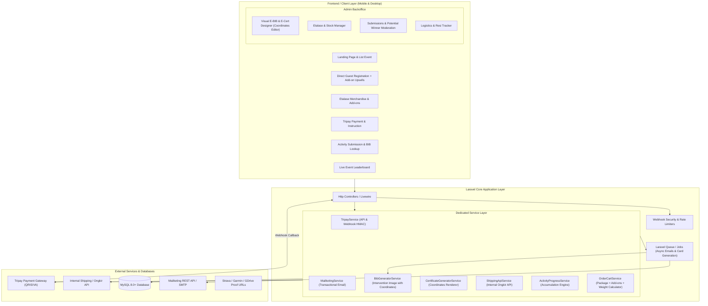
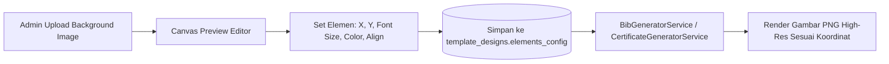
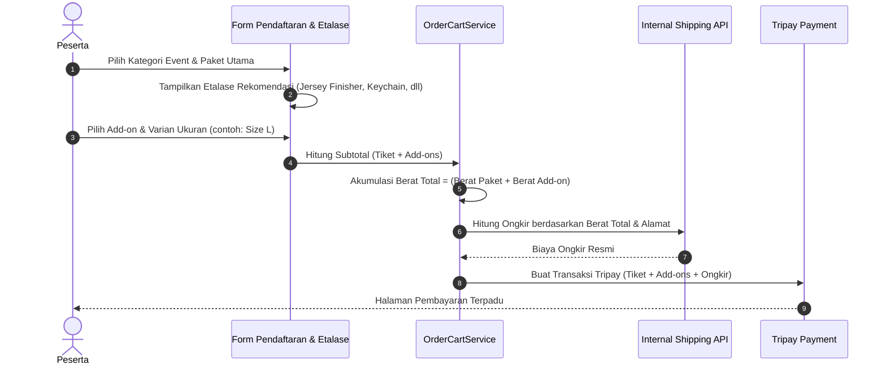
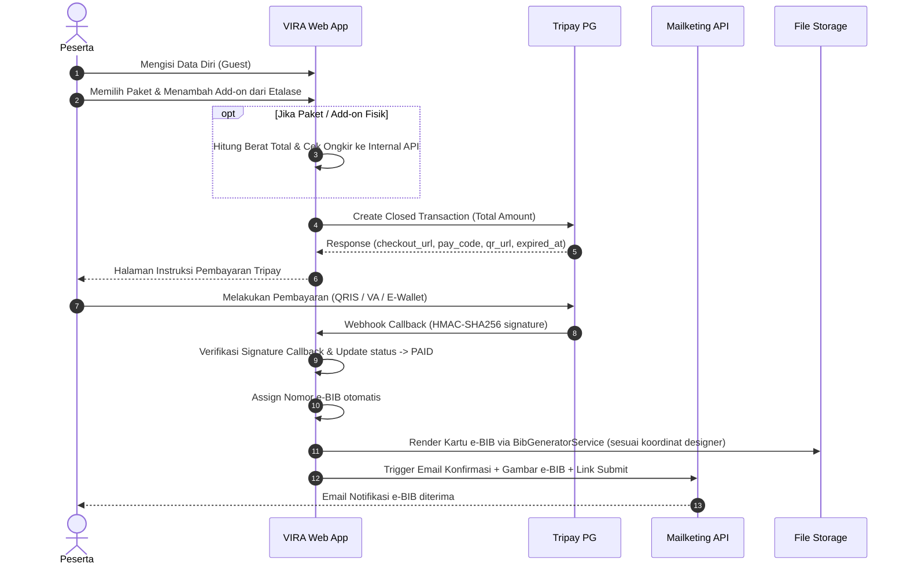
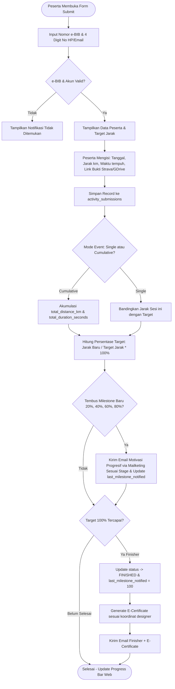

# Design Plan & Technical Architecture — VIRA (Virtual Run, Ride, & Walk)

---

## 1. Arsitektur Sistem (High-Level Architecture)

Aplikasi **VIRA** dibangun dengan arsitektur **Laravel Service-Oriented Monolith** yang modular, cepat, dan mudah di-deploy.



---

## 2. Arsitektur Modul Visual Designer (E-BIB & E-Certificate Builder)

### 2.1 Konsep Kerja Koordinat Canvas
Modul ini memberikan kebebasan penuh kepada Admin dalam menyesuaikan posisi teks di atas background gambar tanpa perlu merombak kode program.



### 2.2 Spesifikasi Elemen yang Dapat Dikonfigurasi
Setiap elemen diatur melalui antarmuka editor yang menyimpan objek JSON:
1. **Pada E-BIB**:
   - `bib_number`: Nomor unik peserta (contoh: `VR10-001`), font besar (*bold athletic*).
   - `participant_name`: Nama lengkap peserta.
   - `category_name`: Nama kategori (contoh: *10K Virtual Run*).
   - `event_name`: Nama event.
   - `qr_code`: Posisi X, Y, dan ukuran kotak QR Code verifikasi.
2. **Pada E-Certificate**:
   - `participant_name`: Nama penerima sertifikat.
   - `bib_number`: Nomor e-BIB.
   - `category_name`: Kategori jarak / event.
   - `total_distance`: Total jarak yang diselesaikan (contoh: *10.00 KM*).
   - `total_duration`: Catatan waktu tempuh resmi (contoh: *00:48:32*).
   - `average_pace`: Pace rata-rata (contoh: *4'51" /km*).
   - `finish_date`: Tanggal penuntasan target.
   - `qr_code`: QR Code keaslian sertifikat digital.

### 2.3 Mekanisme UI Admin Designer
- Admin mengunggah gambar latar belakang (resolusi standar misal 1920x1080 atau 1200x800).
- Layar menampilkan **Interactive Live Preview** dengan teks contoh (*dummy data*).
- Form panel di samping memungkinkan admin:
  - Menggeser slider / menginput angka koordinat `X` dan `Y`.
  - Mengubah ukuran huruf (*Font Size* dalam pt/px).
  - Memilih warna teks menggunakan Color Picker.
  - Memilih format perataan (*Left*, *Center*, *Right*).
  - Toggle tampilkan / sembunyikan elemen (*Visible/Hidden*).
- Tombol **"Test Render"** untuk menguji hasil gambar asli secara instan sebelum disimpan.

---

## 3. Arsitektur Etalase Add-ons & Cross-Selling Merchandise

### 3.1 Alur Pemesanan Add-on


### 3.2 Fitur Etalase Cross-Selling
1. **Checkout Cross-sell**: Ditampilkan secara menarik di halaman pendaftaran sebelum submit pembayaran.
2. **Varian Produk**: Mendukung ukuran pakaian (*S, M, L, XL, XXL*) dan warna dengan penyesuaian harga jika ada.
3. **Pengelolaan Stok Otomatis**: Stok otomatis berkurang saat transaksi berhasil (`PAID`) dan dikembalikan jika pembayaran kedaluwarsa (`EXPIRED`).
4. **Logistik Terpadu**: Di tabel pengiriman admin, tertera rincian paket fisik + seluruh daftar merchandise add-on yang harus dipacking dalam satu paket pengiriman.

---

## 4. Alur Kerja Sistem (System Workflows)

### 4.1 Registrasi, Etalase, Pembayaran Tripay & Notifikasi Mailketing


### 4.2 Submission Aktivitas & Akumulasi Jarak


### 4.3 Algoritma Pengiriman 5-Stage Progressive Motivation Email
Untuk mencegah *spamming* jika peserta mencicil lari dalam jarak-jarak kecil berkali-kali, sistem menggunakan algoritma evaluasi ambang batas (*threshold evaluation*):

```php
// Dijalankan di dalam ActivityProgressService setelah submission tersimpan
$targetDistance = $registration->category->target_distance_km;
$totalDistance  = $registration->total_distance_km;
$percentage     = ($totalDistance / $targetDistance) * 100;

// Milestone kelipatan 20%
$milestones = [20, 40, 60, 80, 100];
$eligibleMilestone = null;

foreach ($milestones as $m) {
    if ($percentage >= $m && $registration->last_milestone_notified < $m) {
        $eligibleMilestone = $m; // Ambil milestone tertinggi yang baru saja dilalui
    }
}

if ($eligibleMilestone !== null) {
    // 1. Ambil template motivasi khusus milestone bersangkutan
    // 2. Dispatch Job kirim email via Mailketing
    SendProgressiveMotivationEmailJob::dispatch($registration, $eligibleMilestone);
    
    // 3. Update status agar tidak terkirim ganda untuk milestone yang sama
    $registration->update(['last_milestone_notified' => $eligibleMilestone]);
}
```

---

## 5. Konsep Desain UI/UX & Tampilan Visual

### 5.1 Identitas Visual & Estetika
- **Gaya Desain**: *Athletic, Sleek, Modern, Energetic*.
- **Palet Warna**:
  - Background Utama: Deep Charcoal / Slate Dark (`#0B0F19`) dengan card container bersih white (`#FFFFFF`) / dark slate (`#131B2E`).
  - Warna Aksen Utama: **Electric Volt Orange** (`#FF5500`) dan **Cyber Neon Cyan** (`#00E5FF`).
  - Finisher Badge: **Vibrant Gold** (`#FFD700`).
- **Tipografi**:
  - Heading: *Outfit* / *Montserrat* (Bold, Modern).
  - BIB Numbers: *Bebas Neue* / *Oswald* (Monospace Athletic).
  - Body Text: *Inter* (Legible, Clean).

### 5.2 Halaman Publik & Admin
1. **Homepage / List Event**: Hero banner dinamis, daftar event run/ride/walk, countdown event.
2. **Form Registrasi & Etalase Cross-Sell**:
   - Step 1: Data Diri (Guest).
   - Step 2: Pilih Kategori & Paket.
   - Step 3: **Etalase Add-ons** (Kartu produk bergambar, tombol (+/-), pemilih ukuran/varian).
   - Step 4: Alamat & Ongkos Kirim (otomatis terhitung sesuai total gram).
   - Step 5: Ringkasan Total & Pembayaran Tripay.
3. **Etalase Stand-alone (`/etalase`)**: Toko merchandise resmi event untuk pembelian terpisah.
4. **Portal Peserta (Cek e-BIB & Submit Lari)**:
   - Akses via nomor e-BIB.
   - Kartu e-BIB visual hasil render designer yang siap download/share.
   - Progress bar akumulasi jarak & riwayat lari.
   - Form input lari & link Strava.
   - Tombol unduh E-Certificate saat status Finisher.
5. **Live Leaderboard**: Klasemen live per kategori & gender.
6. **Admin Backoffice**:
   - **Visual Designer Canvas**: Drag/coordinate editor untuk e-BIB dan E-Sertifikat.
   - **Katalog Etalase & Stok**: Manajemen add-on, varian, dan inventori.
   - **Moderasi & Potential Winners**: Verifikasi bukti Strava pelari terdepan & fitur edit data lari peserta.
   - **Logistik Pengiriman**: Pengelolaan no resi paket race pack dan add-on.

---

## 6. Struktur Routing (URL Endpoints)

| Method | URI Path | Controller Method | Keterangan |
| :--- | :--- | :--- | :--- |
| `GET` | `/` | `HomeController@index` | Beranda & daftar event |
| `GET` | `/event/{slug}` | `EventController@show` | Detail event & rules |
| `GET` | `/event/{slug}/register` | `RegistrationController@create` | Form pendaftaran guest + etalase add-ons |
| `POST` | `/event/{slug}/register` | `RegistrationController@store` | Simpan order, add-ons, & hit Tripay |
| `GET` | `/etalase` | `StorefrontController@index` | Etalase publik merchandise & add-on |
| `GET` | `/payment/{merchant_ref}` | `PaymentController@show` | Instruksi & status bayar Tripay |
| `POST` | `/api/tripay/callback` | `TripayWebhookController@handle` | Webhook receiver Tripay |
| `GET` | `/submit` | `UniversalSubmissionController@index` | **Universal Submission Portal** (Satu link untuk semua event) |
| `POST` | `/submit/lookup` | `UniversalSubmissionController@lookup` | Resolve e-BIB unik, ambil detail event, progres, dan form submit |
| `POST` | `/submit/save` | `UniversalSubmissionController@save` | Simpan hasil lari & akumulasi jarak per event |
| `GET` | `/p/{access_token}` | `ParticipantPortalController@dashboard`| Dashboard peserta via link unik langsung |
| `GET` | `/p/{access_token}/download-bib` | `BibController@download` | Download kartu e-BIB hasil designer |
| `GET` | `/p/{access_token}/certificate` | `CertificateController@download` | Download E-Certificate hasil designer |
| `GET` | `/event/{slug}/leaderboard` | `LeaderboardController@index` | Leaderboard publik live |
| `POST` | `/api/shipping/calculate` | `ShippingController@calculate` | Hitung ongkir internal API (bobot paket + add-on) |
| `GET` | `/admin/events/{id}/designer` | `Admin\DesignerController@edit` | Visual Designer Editor e-BIB & E-Cert |
| `POST` | `/admin/events/{id}/designer` | `Admin\DesignerController@update` | Simpan koordinat & setting tipografi |
| `POST` | `/admin/events/{id}/designer/preview` | `Admin\DesignerController@preview` | Live test render preview canvas |
| `RESOURCE` | `/admin/add-ons` | `Admin\AddOnController` | CRUD etalase merchandise & stok |

---

## 7. Rencana Implementasi Bertahap (Implementation Roadmap)

1. **Fase 1: Inisialisasi & Setup Fondasi Database**:
   - Inisialisasi framework Laravel di direktori `/Users/bangnahan/vira`.
   - Setup migration lengkap (events, categories, packages, template_designs, add_ons, add_on_variants, registration_add_ons, participants, registrations, payments, shipping_addresses, activity_submissions).
   - Eloquent Model, Casting JSON (`elements_config`), dan Relasi.
2. **Fase 2: Core Event, Etalase Add-ons & Pendaftaran Guest**:
   - Manajemen Event, Kategori Jarak, dan Paket.
   - Manajemen Etalase Add-on & Varian Stok.
   - Form pendaftaran guest terpadu dengan etalase cross-sell dan kalkulasi bobot ongkir via API internal.
3. **Fase 3: Integrasi Pembayaran Tripay & Notifikasi Mailketing**:
   - Implementasi `TripayService` (closed payment & webhook handler).
   - Implementasi `MailketingService` untuk pengiriman email transaksional.
4. **Fase 4: Visual Designer Canvas & Render Engine (e-BIB & E-Certificate)**:
   - Modul admin Designer dengan input koordinat X, Y, font size, warna, dan perataan teks.
   - `BibGeneratorService` & `CertificateGeneratorService` yang membaca koordinat JSON dan merender gambar PNG resolusi tinggi.
5. **Fase 5: Submission Aktivitas, Akumulasi & Finisher Trigger**:
   - Form input manual jarak, durasi, dan link bukti Strava/GDrive.
   - Logic akumulasi jarak otomatis dan trigger status Finisher.
   - Auto-generate E-Certificate sesuai koordinat yang telah dirancang.
6. **Fase 6: Leaderboard Publik & Backoffice Moderasi**:
   - Halaman live ranking leaderboard publik.
   - Modul moderasi submission & verifikasi potential winners lomba.
   - Manajemen pengiriman race pack & merchandise add-on (input nomor resi).
